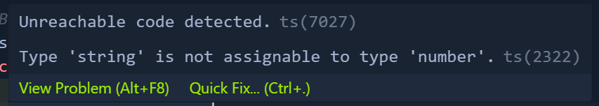

**Functions in TypeScript**
Functions are basic building block of any application, whether they're local functions,or imported from another modules/ methods on a class. 

As we have created a function here, it will use `any` datatype which is an issue. This is because we would be able to use the `string`, `boolean`, etc. values here.

Whole idea behind TypeScript is to make a Stricter type. I know it sounds a bit cringe, but IT IS WHAT IT IS !!.

Hence, the best way to define a function is to just assign the datatype to the variable/parameter while declaring it.

**Better way to Write Functions**
As discussed earlier, we need to write down the type of variable when passing inside a function. But what if the developer does this: 
```bash
    function addNumbers(num: number){
        # return num + 2
        return "Hello World"
    }
```
This is absolutely wrong. To solve this you need to do this:
```bash
    function addNumbers(num: number): number{
        return num + 2
        # The string will give you error, as here you are defining the function to return you only a number value
        return "Hello World" 
    }
```
We get this error when we hover over the String.


We can even use it in arrow functions like this:
```bash
    const heyThere = (name: string):string => {
        return "";
    }
```

**TypeScript is aware of all the context you give**
Consider the following code:
```bash
    const Codes = ["C", "Cpp", "JavaScript", "Python"];
    Codes.map(code => {
        return `Languages are ${Codes}`
    });
```
When you hover onto `Codes` you will see that it is an array of String, but what if i change it into this: 
```bash
    const Codes = [1, 2, 3, 4];
    Codes.map(code => {
        return `Languages are ${Codes}`
    });
```
Here, it will give me an array of Numbers. You can understand from it that TypeScript is very smart enough to understand the context of our code.