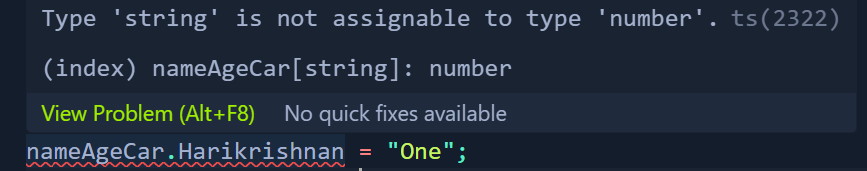

**Objects in TypeScript**
Here, we represent passed data through `object types`. Objects can be anonymous like this:
```bash
    const greet = (person: {name: string, age: number}) => {
        return "Hello" + person.name;
    }
```

They also can be named by using an interface or alias:
```bash
    # Using Interface
    interface Person {
        name: string;
        age: number;
    }

    function newGreet(person: Person){
        return "Hello again: " + person.name;
    }

    # Using Alias 
    type Person {
        name: string;
        age: number;
    }

    function newGreet(person: Person){
        return "Hello again: " + person.name;
    }
```

**Index Signatures**
Index signatures can be used for objetcs without a defined list of properties. We get the following error when we run the object code for `nameAgeCar`: 

