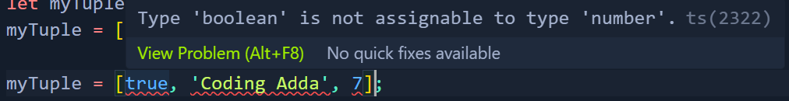
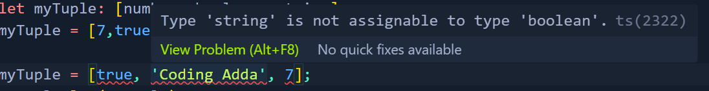
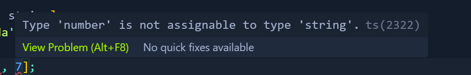

**Tuples In TypeScript**
Tuple is basically a typed array with a pre-defined length and types for each index. Here they allow each element in array to be known type of a value. Syntax to define is :
```bash
    let myTuple: [number, boolean, string];

    myTuple = [7,true, 'Coding Adda'];
```

If we try to give the values in the wrong order, it will give error:
```bash
    Instead of this:
    myTuple = [7, true, 'Coding Adda'];

    We give this:
    myTuple = [true, 'Coding Adda', 7];
```
We get the following errors:




As we do in Arrays, we can also use Readonly keyword to give tuple strongly defined types for initial values
